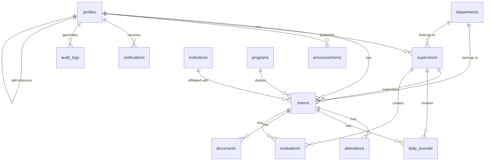
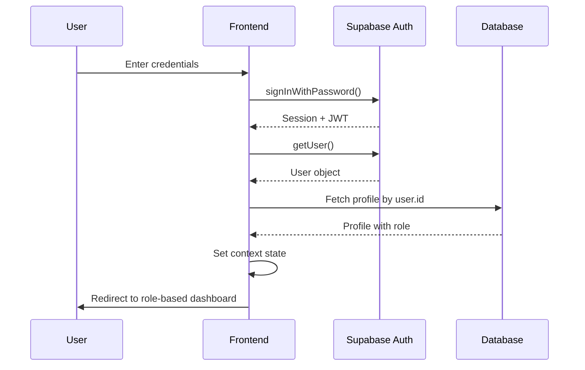
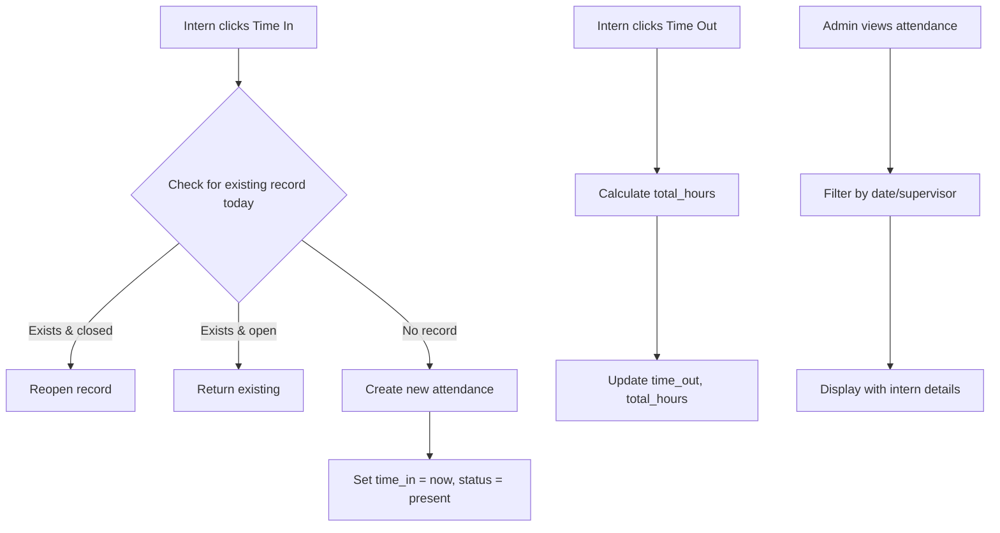
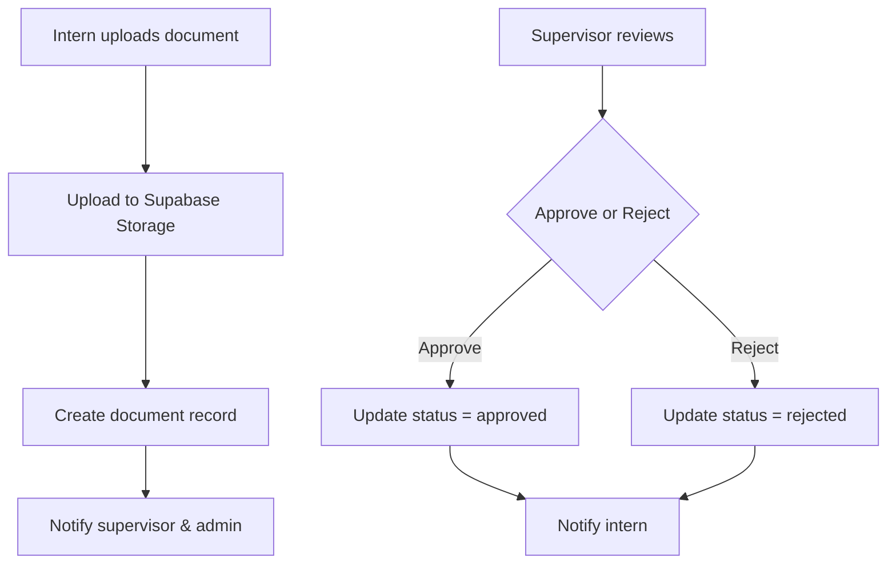
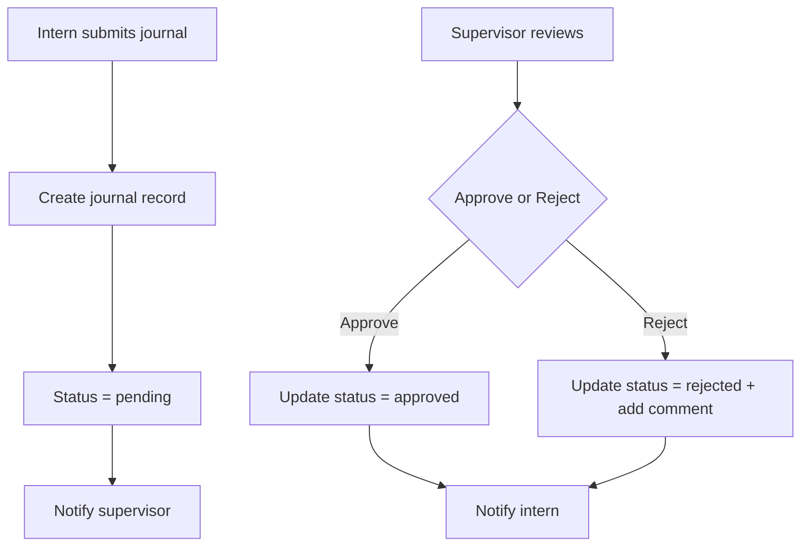

# Project Context & Architecture Blueprint

## 1. Executive Summary & Tech Stack

### Overview
The **Internship Management System (IMS)** is a web application designed to streamline internship management within a single organization. It provides role-based portals for HR Administrators, Supervisors, and Interns to manage attendance, journals, evaluations, documents, and reports.

### Tech Stack

| Layer | Technology | Purpose |
|-------|------------|-----------|
| **Frontend Framework** | React 18 (Vite) | Modern React with fast HMR and build |
| **Styling** | Tailwind CSS 4.x | Utility-first CSS framework |
| **Routing** | React Router DOM 6.x | Client-side routing with protected routes |
| **State Management** | React Context API | Authentication and role-based state |
| **Form Handling** | React Hook Form 7.x | Form validation and submission |
| **HTTP Client** | Supabase JS 2.x | Backend-as-a-service for auth, database, storage |
| **UI Components** | Custom components + FontAwesome | Reusable UI building blocks |
| **Animation** | Framer Motion 12.x | Page and element animations |
| **PDF Generation** | jsPDF + jsPDF-AutoTable | Report generation |
| **QR Code** | qrcode.react | QR code generation for check-in |
| **Deployment** | Vercel | Serverless deployment with SPA routing |

### Directory Structure

```
src/
├── assets/                    # Static assets (images, icons, logos)
├── components/
│   ├── auth/                 # Authentication components
│   ├── layout/               # Sidebar, Navbar, NotificationBell
│   ├── pages/                # Page-specific UI components
│   ├── ui/                   # Reusable UI primitives (Button, Input, Spinner, Avatar)
│   └── ui/icons/             # SVG icon components
├── contexts/
│   └── AuthContext.jsx       # Authentication context provider
├── hooks/                    # Custom React hooks
├── layouts/
│   └── DashboardLayout.jsx   # Main app shell with sidebar/navbar
├── lib/
│   ├── constants.js          # Role/status enums and labels
│   ├── mockBackend.js        # Mock data utilities
│   └── supabase.js           # Supabase client initialization
├── pages/
│   ├── admin/                # HR Administrator pages
│   ├── auth/                 # Login, Forgot/Reset Password
│   ├── intern/               # Intern portal pages
│   ├── supervisor/           # Supervisor portal pages
│   └── ProfileSettings.jsx   # User profile page
├── routes/
│   ├── ProtectedRoute.jsx    # Route guard for authenticated users
│   └── RoleRoute.jsx         # Role-based route restriction
├── services/                 # Business logic services (API wrappers)
├── styles/                   # Global styles
├── types/                    # TypeScript type definitions
├── utils/                    # Utility functions
├── App.jsx                   # Main application routes
└── main.jsx                  # Application entry point
```

---

## 2. Database Schema & Data Models

### Core Tables

#### `profiles` (Authentication Link)
| Column | Type | Constraints | Description |
|--------|------|-------------|-------------|
| `id` | UUID | PK, FK → `auth.users(id)` | Primary key, links to Supabase auth |
| `full_name` | TEXT | NOT NULL DEFAULT '' | User's display name |
| `email` | TEXT | — | Email address |
| `avatar_url` | TEXT | — | Profile picture URL |
| `contact_number` | TEXT | — | Phone number |
| `bio` | TEXT | — | Short biography |
| `role` | `user_role` | NOT NULL DEFAULT 'intern' | User role enum |
| `intern_id` | UUID | FK → `interns(id)` | Links to intern record |
| `supervisor_id` | UUID | FK → `supervisors(id)` | Links to supervisor record |
| `created_at` | TIMESTAMPTZ | NOT NULL DEFAULT now() | Record creation timestamp |
| `updated_at` | TIMESTAMPTZ | NOT NULL DEFAULT now() | Last update timestamp |

#### `interns`
| Column | Type | Constraints | Description |
|--------|------|-------------|-------------|
| `id` | UUID | PK | Primary key |
| `profile_id` | UUID | FK → `profiles(id)` | Links to auth profile |
| `full_name` | TEXT | NOT NULL | Intern's full name |
| `student_number` | TEXT | — | School student ID |
| `contact_number` | TEXT | — | Contact phone |
| `email` | TEXT | — | Email address |
| `emergency_contact` | TEXT | — | Emergency contact info |
| `institution_id` | UUID | FK → `institutions(institution_id)` | School/organization |
| `program_id` | UUID | FK → `programs(program_id)` | Academic program |
| `department_id` | UUID | FK → `departments(id)` | Company department |
| `supervisor_id` | UUID | FK → `supervisors(id)` | Assigned supervisor |
| `start_date` | DATE | — | Internship start date |
| `end_date` | DATE | — | Internship end date |
| `required_hours` | NUMERIC | NOT NULL DEFAULT 300 | Required hours |
| `status` | `intern_status` | NOT NULL DEFAULT 'active' | active/completed/archived |
| `created_by` | UUID | FK → `profiles(id)` | Admin who created |
| `is_active` | BOOLEAN | DEFAULT TRUE | Active flag |
| `archived_by` | UUID | FK → `profiles(id)` | Archive handler |
| `archived_reason` | TEXT | — | Archive reason |
| `archived_at` | TIMESTAMPTZ | — | Archive timestamp |
| `restored_by` | UUID | FK → `profiles(id)` | Restore handler |
| `restored_at` | TIMESTAMPTZ | — | Restore timestamp |

#### `supervisors`
| Column | Type | Constraints | Description |
|--------|------|-------------|-------------|
| `id` | UUID | PK | Primary key |
| `profile_id` | UUID | FK → `profiles(id)` | Links to auth profile |
| `department_id` | UUID | FK → `departments(id)` | Department affiliation |
| `full_name` | TEXT | — | Supervisor name |
| `email` | TEXT | — | Email address |
| `created_by` | UUID | FK → `profiles(id)` | Admin who created |
| `created_at` | TIMESTAMPTZ | NOT NULL DEFAULT now() | Creation timestamp |

#### `departments`
| Column | Type | Constraints | Description |
|--------|------|-------------|-------------|
| `id` | UUID | PK | Primary key |
| `name` | TEXT | NOT NULL UNIQUE | Department name |
| `description` | TEXT | — | Department description |
| `created_at` | TIMESTAMPTZ | NOT NULL DEFAULT now() | Creation timestamp |

#### `attendance`
| Column | Type | Constraints | Description |
|--------|------|-------------|-------------|
| `id` | UUID | PK | Primary key |
| `intern_id` | UUID | NOT NULL, FK → `interns(id)` | Intern reference |
| `date` | DATE | NOT NULL DEFAULT current_date | Attendance date |
| `time_in` | TIMESTAMPTZ | — | Clock-in timestamp |
| `time_out` | TIMESTAMPTZ | — | Clock-out timestamp |
| `total_hours` | NUMERIC | NOT NULL DEFAULT 0 | Computed hours |
| `method` | TEXT | DEFAULT 'manual' | Check-in method |
| `status` | `attendance_status` | NOT NULL DEFAULT 'present' | present/late/absent/pending |
| `created_at` | TIMESTAMPTZ | NOT NULL DEFAULT now() | Creation timestamp |

#### `daily_journals`
| Column | Type | Constraints | Description |
|--------|------|-------------|-------------|
| `id` | UUID | PK | Primary key |
| `intern_id` | UUID | NOT NULL, FK → `interns(id)` | Intern reference |
| `supervisor_id` | UUID | FK → `supervisors(id)` | Assigned supervisor |
| `date` | DATE | NOT NULL DEFAULT current_date | Journal date |
| `activities` | TEXT | NOT NULL | Daily activities |
| `hours_worked` | NUMERIC | NOT NULL DEFAULT 0 | Hours spent |
| `challenges` | TEXT | — | Challenges faced |
| `learnings` | TEXT | — | Key learnings |
| `status` | `journal_status` | NOT NULL DEFAULT 'pending' | pending/approved/rejected |
| `supervisor_comment` | TEXT | — | Supervisor feedback |
| `created_at` | TIMESTAMPTZ | NOT NULL DEFAULT now() | Creation timestamp |

#### `documents`
| Column | Type | Constraints | Description |
|--------|------|-------------|-------------|
| `id` | UUID | PK | Primary key |
| `intern_id` | UUID | NOT NULL, FK → `interns(id)` | Intern reference |
| `type` | TEXT | NOT NULL CHECK IN (...) | resume/moa/endorsement/... |
| `label` | TEXT | — | Document label |
| `file_path` | TEXT | — | Storage path |
| `file_url` | TEXT | — | Public URL |
| `file_name` | TEXT | — | Original filename |
| `status` | `document_status` | NOT NULL DEFAULT 'pending' | pending/approved/rejected |
| `created_at` | TIMESTAMPTZ | NOT NULL DEFAULT now() | Creation timestamp |

#### `evaluations`
| Column | Type | Constraints | Description |
|--------|------|-------------|-------------|
| `id` | UUID | PK | Primary key |
| `intern_id` | UUID | NOT NULL, FK → `interns(id)` | Intern reference |
| `supervisor_id` | UUID | FK → `supervisors(id)` | Evaluating supervisor |
| `attendance` | INTEGER | DEFAULT 0 CHECK 0-5 | Score 0-5 |
| `communication` | INTEGER | DEFAULT 0 CHECK 0-5 | Score 0-5 |
| `teamwork` | INTEGER | DEFAULT 0 CHECK 0-5 | Score 0-5 |
| `initiative` | INTEGER | DEFAULT 0 CHECK 0-5 | Score 0-5 |
| `technical_skills` | INTEGER | DEFAULT 0 CHECK 0-5 | Score 0-5 |
| `professionalism` | INTEGER | DEFAULT 0 CHECK 0-5 | Score 0-5 |
| `overall_rating` | INTEGER | DEFAULT 0 CHECK 0-5 | Average score |
| `comments` | TEXT | — | Evaluation comments |
| `final_recommendation` | TEXT | NULL or CHECK IN (...) | highly_recommend/recommend/... |
| `status` | `evaluation_status` | NOT NULL DEFAULT 'pending' | pending/approved/rejected |
| `created_at` | TIMESTAMPTZ | NOT NULL DEFAULT now() | Creation timestamp |

#### `announcements`
| Column | Type | Constraints | Description |
|--------|------|-------------|-------------|
| `id` | UUID | PK | Primary key |
| `title` | TEXT | NOT NULL | Announcement title |
| `body` | TEXT | NOT NULL | Announcement content |
| `category` | TEXT | NOT NULL DEFAULT 'company_news' | company_news/schedule/deadline/reminder |
| `published_by` | UUID | FK → `profiles(id)` | Publishing user |
| `pinned` | BOOLEAN | NOT NULL DEFAULT false | Pinned to top |
| `created_at` | TIMESTAMPTZ | NOT NULL DEFAULT now() | Creation timestamp |

#### `notifications`
| Column | Type | Constraints | Description |
|--------|------|-------------|-------------|
| `id` | UUID | PK | Primary key |
| `user_id` | UUID | NOT NULL, FK → `profiles(id)` | Recipient |
| `type` | TEXT | NOT NULL CHECK IN (...) | announcement/journal_review/... |
| `title` | TEXT | NOT NULL | Notification title |
| `message` | TEXT | NOT NULL | Notification body |
| `link` | TEXT | — | Deep link URL |
| `is_read` | BOOLEAN | DEFAULT false | Read status |
| `read_at` | TIMESTAMPTZ | — | Read timestamp |
| `metadata` | JSONB | DEFAULT '{}' | Additional data |
| `created_at` | TIMESTAMPTZ | NOT NULL DEFAULT now() | Creation timestamp |

#### `audit_logs`
| Column | Type | Constraints | Description |
|--------|------|-------------|-------------|
| `id` | UUID | PK | Primary key |
| `user_id` | UUID | FK → `profiles(id)` | Acting user |
| `action` | TEXT | NOT NULL | create/update/delete/login |
| `resource_type` | TEXT | NOT NULL | Table name |
| `resource_id` | UUID | — | Record ID |
| `changes` | JSONB | DEFAULT '{}' | Change details |
| `ip_address` | TEXT | — | Client IP |
| `user_agent` | TEXT | — | Browser info |
| `created_at` | TIMESTAMPTZ | NOT NULL DEFAULT now() | Timestamp |

### Relationships



### Media & Storage Handling

- **Storage Bucket:** `intern-documents` (Supabase Storage)
- **Upload Path Format:** `{internId}/{timestamp}-{filename}`
- **File Types:** PDF, images (resume, MOA, endorsement letters, school requirements, completion reports)
- **Access Control:** Row Level Security (RLS) policies restrict access to authorized users
- **Signed URLs:** Generated on-demand for secure file downloads (60-second expiry)

---

## 3. Core Business Logic & Workflows

### Authentication & User Flow



**Key Components:**
- `AuthContext.jsx` - Central authentication state management
- `authService.js` - Supabase Auth wrapper (signIn, signOut, password reset)
- `profileService.js` - Profile CRUD operations
- `ProtectedRoute.jsx` - Route guard for authenticated users
- `RoleRoute.jsx` - Role-based access control

### Key Workflows

#### Attendance Management



#### Document Upload & Review



#### Journal Submission & Review



### API Endpoints / URL Routing

#### Public Routes (No Auth Required)
| Path | Component | Purpose |
|------|-----------|---------|
| `/login` | Login.jsx | User authentication |
| `/forgot-password` | ForgotPassword.jsx | Password reset request |
| `/reset-password` | ResetPassword.jsx | Password reset form |

#### Protected Routes (Authenticated Users)
| Path | Component | Roles | Purpose |
|------|-----------|-------|---------|
| `/profile` | ProfileSettings.jsx | All | User profile management |
| `/` | Redirect | All | Root redirect |
| `*` | Redirect | All | 404 redirect |

#### Admin Routes (admin, hr_staff)
| Path | Component | Purpose |
|------|-----------|---------|
| `/admin` | AdminDashboard.jsx | Overview cards |
| `/admin/interns` | InternManagement.jsx | Intern CRUD |
| `/admin/supervisors` | AdminSupervisors.jsx | Supervisor CRUD |
| `/admin/attendance` | AdminAttendance.jsx | Attendance management |
| `/admin/journals` | AdminJournals.jsx | Journal review |
| `/admin/documents` | AdminDocuments.jsx | Document review |
| `/admin/evaluations` | AdminEvaluations.jsx | Evaluation management |
| `/admin/announcements` | AdminAnnouncements.jsx | Announcement CRUD |
| `/admin/reports` | AdminReports.jsx | Report generation |
| `/admin/settings` | AdminSettings.jsx | System configuration |
| `/admin/institutions` | AdminInstitutions.jsx | School management |
| `/admin/institutions/:id` | InstitutionProfile.jsx | Institution details |
| `/admin/audit-logs` | AdminAuditLogs.jsx | Activity audit trail |

#### Supervisor Routes (supervisor)
| Path | Component | Purpose |
|------|-----------|---------|
| `/supervisor` | SupervisorDashboard.jsx | Overview cards |
| `/supervisor/interns` | SupervisorInterns.jsx | Assigned interns list |
| `/supervisor/attendance` | SupervisorAttendance.jsx | Attendance review |
| `/supervisor/journals` | SupervisorJournals.jsx | Journal review |
| `/supervisor/evaluations` | SupervisorEvaluations.jsx | Evaluation creation |

#### Intern Routes (intern)
| Path | Component | Purpose |
|------|-----------|---------|
| `/intern` | InternDashboard.jsx | Overview cards |
| `/intern/attendance` | InternAttendance.jsx | Time in/out, history |
| `/intern/journal` | InternJournal.jsx | Journal submission |
| `/intern/documents` | InternDocuments.jsx | Document upload |
| `/intern/evaluation` | InternEvaluation.jsx | View evaluation |
| `/intern/announcements` | InternAnnouncements.jsx | Announcements list |

---

## 4. Environment & Deployment Configuration

### Environment Variables

| Variable | Description | Required |
|----------|-------------|----------|
| `VITE_SUPABASE_URL` | Supabase project URL | Yes |
| `VITE_SUPABASE_ANON_KEY` | Supabase anonymous key | Yes |

**Note:** The application requires a configured Supabase project. There is no demo/mock fallback.

### Middleware & Settings

- **CORS:** Configured in Supabase project settings
- **Session Persistence:** Enabled (`persistSession: true`)
- **Auto Refresh Token:** Enabled (`autoRefreshToken: true`)
- **Session Detection:** URL-based (`detectSessionInUrl: true`)

### Deployment Pipeline

**Platform:** Vercel

**Configuration (`vercel.json`):**
```json
{
  "rewrites": [
    { "source": "/api/(.*)", "destination": "/api/$1" },
    { "source": "/(.*)", "destination": "/index.html" }
  ]
}
```

**Build Settings:**
- **Build Command:** `vite build`
- **Output Directory:** `dist`
- **Framework:** Custom (Vite)

### Critical Third-Party Integrations

| Service | Purpose | Integration |
|---------|---------|-------------|
| **Supabase** | Auth, Database, Storage | Primary backend (all data/services) |
| **Font Awesome** | Icons | CSS CDN in index.html |
| **Vercel Analytics** | Web analytics | Script tag in index.html |

### Asynchronous/Background Tasks

The application uses **Supabase Realtime** for reactive updates:
- Auth state changes via `onAuthStateChange()` subscription
- Real-time notifications via Supabase Realtime (if enabled)
- No dedicated task queues (Celery/Redis) - all operations are synchronous HTTP requests

### Services Architecture

```
┌─────────────────────────────────────────────────────────────┐
│                        Services Layer                       │
├─────────────────────────────────────────────────────────────┤
│  authService.js       → Supabase Auth API                   │
│  internService.js     → profiles, interns, departments      │
│  supervisorService.js → supervisors, profiles              │
│  attendanceService.js → attendance (time in/out)           │
│  journalService.js    → daily_journals                     │
│  documentService.js   → documents + Storage bucket          │
│  evaluationService.js → evaluations                        │
│  announcementService.js → announcements                     │
│  notificationService.js → notifications table               │
│  auditLogService.js   → audit_logs                         │
│  settingsService.js   → settings (singleton)               │
│  departmentService.js → departments                        │
│  institutionService.js → institutions                      │
│  programService.js    → programs                           │
│  userService.js       → auth.users (delete)                │
│  dashboardService.js  → aggregated dashboard data           │
│  activityService.js   → notification dispatch              │
└─────────────────────────────────────────────────────────────┘
```

### Security Model

- **Row Level Security (RLS):** Enabled on all tables
- **Role-Based Access Control:** Implemented via `RoleRoute` component
- **Session Management:** JWT-based with automatic refresh
- **Storage Security:** Signed URLs for file downloads
- **Audit Trail:** `audit_logs` table tracks all critical operations