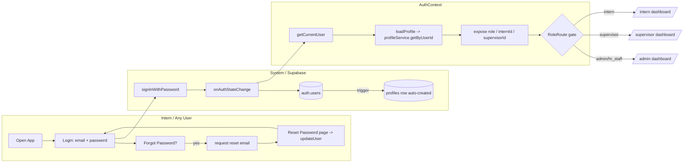
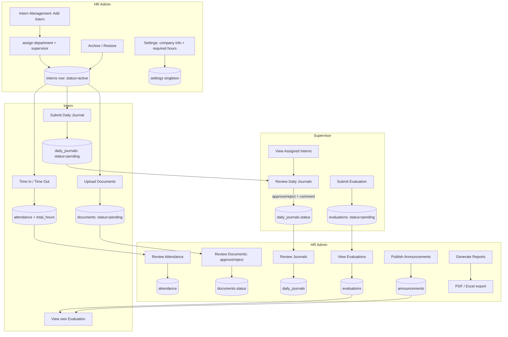
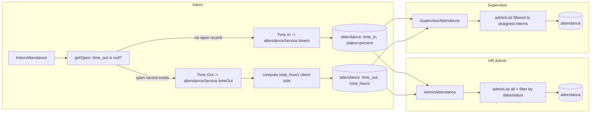
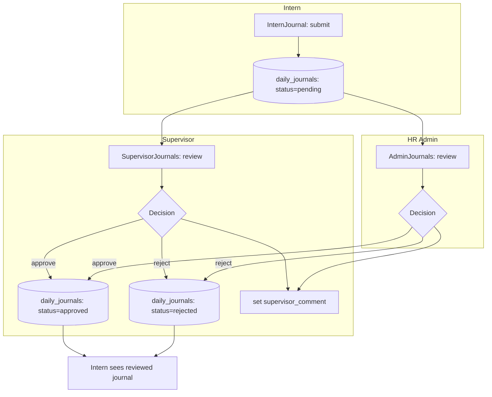
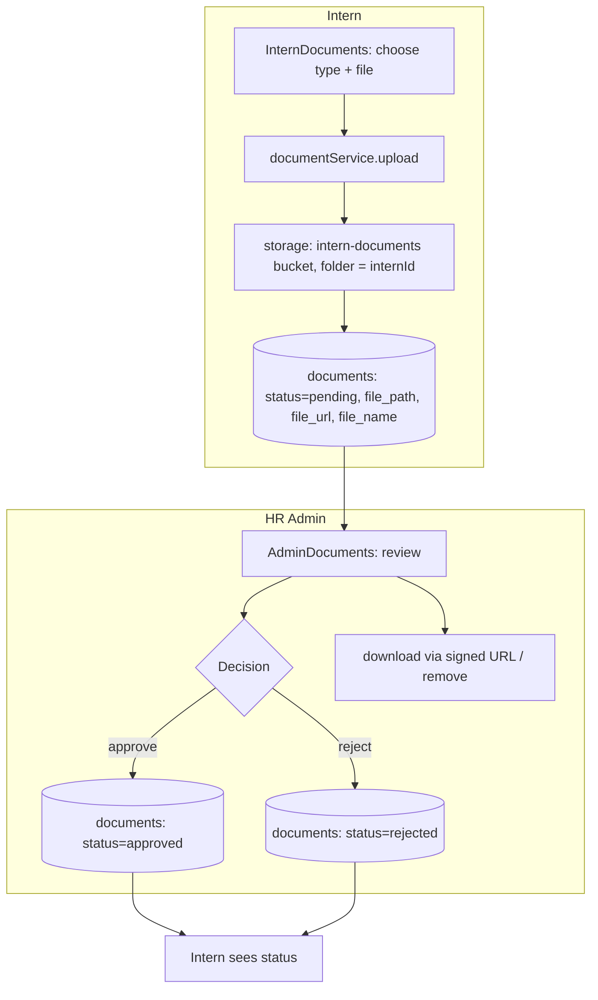
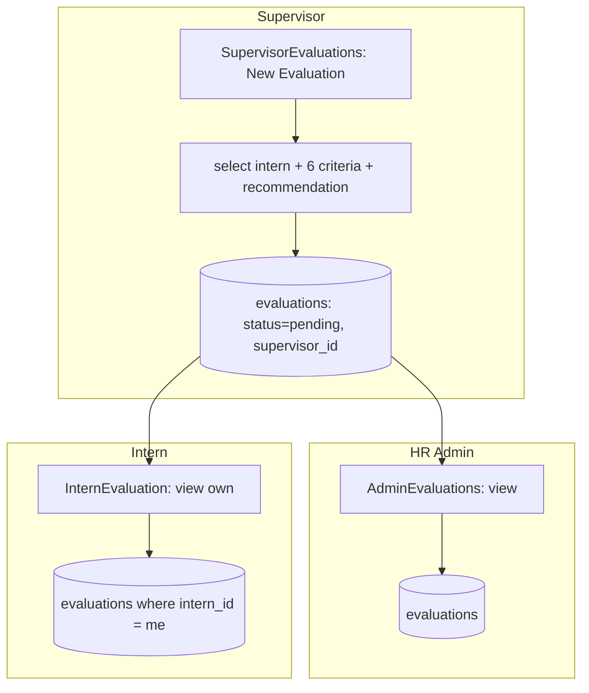
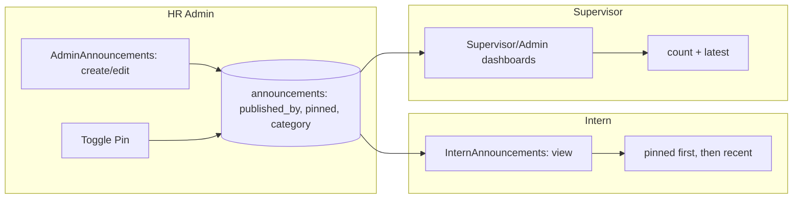
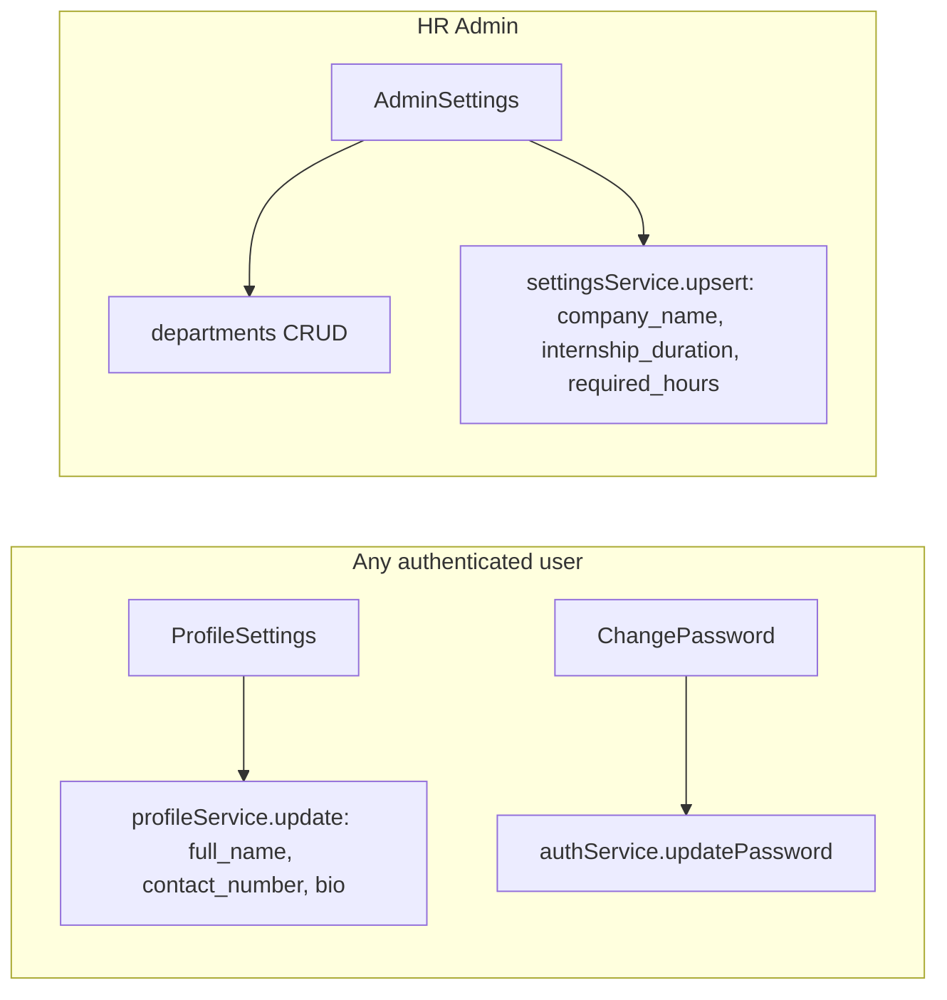
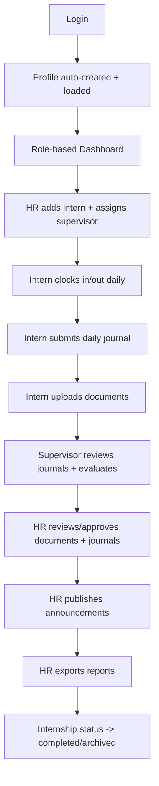

# Internship Management System — Workflow Reference

> Reverse-engineered from the codebase (`src/pages/*`, `src/services/*`, `src/routes/*`,
> `src/contexts/AuthContext.jsx`, `src/lib/constants.js`, `src/lib/navigation.js`, `src/App.jsx`).
> This document describes the actual flows implemented in the app, organized as **swimlane diagrams**
> (one lane per actor/role) using Mermaid.

---

## 1. Actors / Swimlanes

| Lane | Role | Entry points |
| --- | --- | --- |
| **System / Supabase** | Auth + DB + Storage | `auth.users`, `profiles` (auto-created), RLS |
| **HR Admin / HR Staff** | `admin`, `hr_staff` | `/admin/*` |
| **Supervisor** | `supervisor` | `/supervisor/*` |
| **Intern** | `intern` | `/intern/*` |

Route gating (from `src/App.jsx` + `src/routes/RoleRoute.jsx`):
- `/admin/*` → `RoleRoute roles={["admin","hr_staff"]}`
- `/supervisor/*` → `RoleRoute roles={["supervisor"]}`
- `/intern/*` → `RoleRoute roles={["intern"]}`
- All app routes wrapped in `ProtectedRoute` (requires authenticated user with a resolved `profile.role`).

---

## 2. Authentication & Profile Bootstrap

Every session begins here. The `on_auth_user_created` trigger provisions a `profiles` row; the
`AuthContext` loads it and exposes `role`, `internId`, `supervisorId`.



---

## 3. Intern Lifecycle (cross-role swimlane)

This is the core end-to-end flow spanning all three roles.



---

## 4. Daily Attendance Workflow



Notes:
- `attendanceService.timeIn` inserts `status='present'`; `timeOut` computes hours via `diffHours()` in
  `src/utils/format.js` (client-side, not a DB trigger).
- A partial unique index `attendance_open_unique` enforces **one open record per intern per day**.

---

## 5. Daily Journal Workflow



Notes:
- Admin review passes `supervisor_id = null` (admin acts, not a supervisor). Supervisor review passes
  their own `supervisorId`.

---

## 6. Document Workflow



Notes:
- Storage RLS: intern can `INSERT` only into a folder named with their own `current_intern_id()`;
  admins have full `ALL` on the bucket.

---

## 7. Evaluation Workflow



Notes:
- `evaluations.status` is the `evaluation_status` enum (`pending`/`completed`/`archived`). New
  evaluations are created as `pending`, which feeds the "Pending Evaluations" dashboard counters.
- Criteria: `attendance, communication, teamwork, initiative, technical_skills, professionalism`
  (each 0–5) + `overall_rating` + `final_recommendation`.

---

## 8. Announcements Workflow



---

## 9. Reports Workflow (client-side aggregation)

```mermaid
flowchart LR
    subgraph HR[HR Admin]
        A[AdminReports] --> B{Select report type}
        B -->|intern_list / attendance / journals / evaluations / hours| C[service.list across tables]
        C --> D[build row objects]
        D --> E[Preview / Export Excel (xlsx) / Export PDF (jspdf)]
    end
```

Notes:
- There is **no `reports` table**. Reports are computed in `AdminReports.jsx` by aggregating
  `interns`, `attendance`, `daily_journals`, and `evaluations`.

---

## 10. Profile & Settings Workflow



---

## 11. Permission / Visibility Matrix (per swimlane)

| Capability | HR Admin / HR Staff | Supervisor | Intern |
| --- | --- | --- | --- |
| Manage interns / supervisors / departments | ✅ | ❌ | ❌ |
| Time in/out | (all attendance) | view assigned | own |
| Submit daily journal | (all) | review assigned | own |
| Upload documents | review all | (read) | own |
| Evaluate | view all | create for assigned | view own |
| Publish announcements | ✅ | ❌ | ❌ |
| Generate reports | ✅ | ❌ | ❌ |
| Edit company settings | ✅ | ❌ | ❌ |
| Edit own profile / password | ✅ | ✅ | ✅ |

All data access is additionally enforced by **Row Level Security** (see `DATABASE_SCHEMA.md` §12),
so the UI gates above are defense-in-depth, not the only control.

---

## 12. End-to-End Summary (single timeline)



---

*Generated from the IMS codebase. Every node maps to a real page (`src/pages/*`), service
(`src/services/*`), or database object (`DATABASE_SCHEMA.sql`).*
